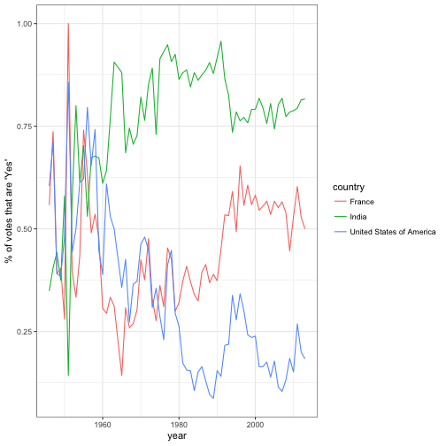
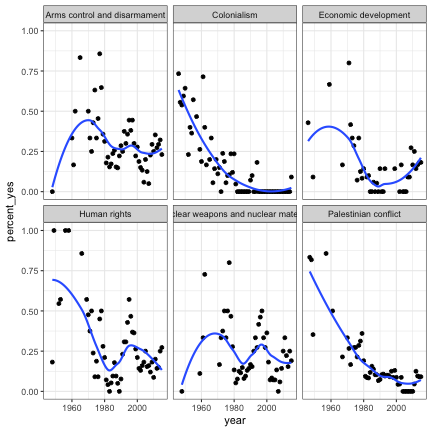

<!-- README.md is generated from README.Rmd. Please edit that file -->


## United Nations General Assembly Voting Data

[](https://cran.r-project.org/package=unvotes)
[](https://travis-ci.org/dgrtwo/unvotes)

This package provides the voting history of countries in the [United Nations General Assembly](http://www.un.org/en/ga/), along with information such as date, description, and topics for each vote.

These come from the dataset [found here](https://dataverse.harvard.edu/dataset.xhtml?persistentId=hdl:1902.1/12379):

> Erik Voeten "Data and Analyses of Voting in the UN General Assembly" Routledge Handbook of International Organization, edited by Bob Reinalda (published May 27, 2013)

This raw data, and the processing script, can be found in the [data-raw](data-raw) folder.

### Installation

Install the package with:


```r
install.packages("unvotes")
```

You can also install the development version of the package using [devtools](https://github.com/hadley/devtools):


```r
devtools::install_github("dgrtwo/unvotes")
```

### Datasets

The package contains three datasets. First is the history of each country's vote. These are represented in the `un_votes` dataset, with one row for each country/vote pair:


```r
library(dplyr)
library(unvotes)

un_votes
#> # A tibble: 738,764 × 3
#>     rcid                  country   vote
#>    <int>                    <chr> <fctr>
#> 1      3 United States of America    yes
#> 2      3                   Canada     no
#> 3      3                     Cuba    yes
#> 4      3                    Haiti    yes
#> 5      3       Dominican Republic    yes
#> 6      3                   Mexico    yes
#> 7      3                Guatemala    yes
#> 8      3                 Honduras    yes
#> 9      3              El Salvador    yes
#> 10     3                Nicaragua    yes
#> # ... with 738,754 more rows
```

The package also contains a dataset of information about each roll call vote, including the date, description, and relevant resolution that was voted on:


```r
un_roll_calls
#> # A tibble: 5,429 × 9
#>     rcid session importantvote       date   unres amend  para
#>    <int>   <dbl>         <dbl>     <date>   <chr> <dbl> <dbl>
#> 1      3       1             0 1946-01-01  R/1/66     1     0
#> 2      4       1             0 1946-01-02  R/1/79     0     0
#> 3      5       1             0 1946-01-04  R/1/98     0     0
#> 4      6       1             0 1946-01-04 R/1/107     0     0
#> 5      7       1             0 1946-01-02 R/1/295     1     0
#> 6      8       1             0 1946-01-05 R/1/297     1     0
#> 7      9       1             0 1946-02-05 R/1/329     0     0
#> 8     10       1             0 1946-02-05 R/1/361     1     1
#> 9     11       1             0 1946-02-05 R/1/376     0     0
#> 10    12       1             0 1946-02-06 R/1/394     1     1
#> # ... with 5,419 more rows, and 2 more variables: short <chr>, descr <chr>
```

Finally, the `un_roll_call_issues` dataset shows relationships betwen each vote and 6 issues:


```r
un_roll_call_issues
#> # A tibble: 5,281 × 3
#>     rcid short_name                issue
#>    <int>      <chr>                <chr>
#> 1   3372         me Palestinian conflict
#> 2   3658         me Palestinian conflict
#> 3   3692         me Palestinian conflict
#> 4   2901         me Palestinian conflict
#> 5   3020         me Palestinian conflict
#> 6   3217         me Palestinian conflict
#> 7   3298         me Palestinian conflict
#> 8   3429         me Palestinian conflict
#> 9   3558         me Palestinian conflict
#> 10  3625         me Palestinian conflict
#> # ... with 5,271 more rows

count(un_roll_call_issues, issue, sort = TRUE)
#> # A tibble: 6 × 2
#>                                  issue     n
#>                                  <chr> <int>
#> 1                 Palestinian conflict  1104
#> 2                          Colonialism   991
#> 3                         Human rights   986
#> 4         Arms control and disarmament   956
#> 5 Nuclear weapons and nuclear material   762
#> 6                 Economic development   482
```

(Use `help()` to get information and documentation about each dataset).

### Example analysis

Many useful analyses will first involve joining the vote and roll call datasets by the shared `rcid` (roll call ID) column:


```r
library(dplyr)

joined <- un_votes %>%
  inner_join(un_roll_calls, by = "rcid")

joined
#> # A tibble: 738,764 × 11
#>     rcid                  country   vote session importantvote       date
#>    <int>                    <chr> <fctr>   <dbl>         <dbl>     <date>
#> 1      3 United States of America    yes       1             0 1946-01-01
#> 2      3                   Canada     no       1             0 1946-01-01
#> 3      3                     Cuba    yes       1             0 1946-01-01
#> 4      3                    Haiti    yes       1             0 1946-01-01
#> 5      3       Dominican Republic    yes       1             0 1946-01-01
#> 6      3                   Mexico    yes       1             0 1946-01-01
#> 7      3                Guatemala    yes       1             0 1946-01-01
#> 8      3                 Honduras    yes       1             0 1946-01-01
#> 9      3              El Salvador    yes       1             0 1946-01-01
#> 10     3                Nicaragua    yes       1             0 1946-01-01
#> # ... with 738,754 more rows, and 5 more variables: unres <chr>,
#> #   amend <dbl>, para <dbl>, short <chr>, descr <chr>
```

One could then count how often each country votes "yes" on a resolution in each year:


```r
library(lubridate)

by_country_year <- joined %>%
  group_by(year = year(date), country) %>%
  summarize(votes = n(),
            percent_yes = mean(vote == "yes"))

by_country_year
#> Source: local data frame [9,689 x 4]
#> Groups: year [?]
#> 
#>     year                          country votes percent_yes
#>    <dbl>                            <chr> <int>       <dbl>
#> 1   1946                      Afghanistan    17   0.4117647
#> 2   1946                        Argentina    43   0.6976744
#> 3   1946                        Australia    43   0.5581395
#> 4   1946                          Belarus    43   0.4418605
#> 5   1946                          Belgium    43   0.6046512
#> 6   1946 Bolivia (Plurinational State of)    43   0.6976744
#> 7   1946                           Brazil    43   0.6046512
#> 8   1946                           Canada    42   0.6428571
#> 9   1946                            Chile    43   0.6046512
#> 10  1946                         Colombia    42   0.3095238
#> # ... with 9,679 more rows
```

After which this can be visualized for one or more countries:


```r
library(ggplot2)
theme_set(theme_bw())

countries <- c("United States", "United Kingdom", "India", "France")

# there were fewer votes in 2013
by_country_year %>%
  filter(country %in% countries, year <= 2013) %>%
  ggplot(aes(year, percent_yes, color = country)) +
  geom_line() +
  ylab("% of votes that are 'Yes'")
```



Similarly, we could look at how the voting record of the United States has changed on each of the issues by joining with the `un_roll_call_issues` dataset:


```r
joined %>%
  filter(country == "United States") %>%
  inner_join(un_roll_call_issues, by = "rcid") %>%
  group_by(year = year(date), issue) %>%
  summarize(votes = n(),
            percent_yes = mean(vote == "yes")) %>%
  filter(votes > 5) %>%
  ggplot(aes(year, percent_yes)) +
  geom_point() +
  geom_smooth(se = FALSE) +
  facet_wrap(~ issue)
#> Error: Faceting variables must have at least one value
```



### Code of Conduct

Please note that this project is released with a [Contributor Code of Conduct](CONDUCT.md). By participating in this project you agree to abide by its terms.
